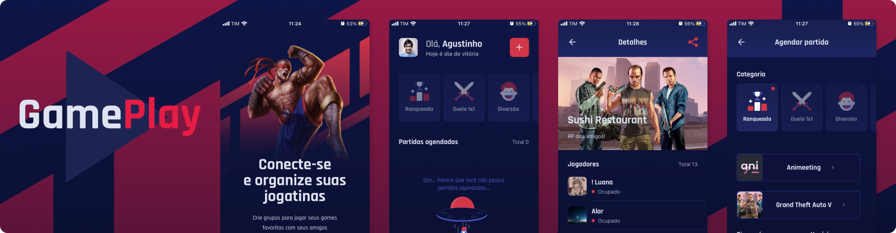

<p align="center">
 
</p>

---

<h3 align="center">GamePlay</h3>

Aplicação desenvolvida durante a **Next Level Week** da [Rocketseat](https://rocketseat.com.br) para lhe auxiliar na hora de marcar suas jogatinas!
<br /><br />

## 📝 Conteúdo

- [Sobre](#about)
- [Funcionalidades](#tools)
- [Instalação](#install)
- [Tecnologias utilizadas](#built_using)
- [Vídeo](#video)
- [Autores](#authors)
  <br /><br />

## 🧐 Sobre <a name = "about"></a>

A aplicação é um organizador de partidas multiplayer, permitindo agendar partidas da maioria dos jogos e vincular a um servidor do [Discord](https://www.discord.com). Assim, não só possível ver os usuários disponíveis no servidor, mas também compartilhar o link de convite outros amigos!<br /><br />

## 🔧 Funcionalidades <a name = "tools"></a>

- Autenticação social com o [Discord](https://www.discord.com);
- Agendamento e exclusão de partidas;
- Listagem de partidas por filtro;
- Escolha de jogos utilizando a API da [RAWG](https://www.rawg.io/apidocs);
- Visualização dos usuários do servidor da partida;
- Compartilhamento do link para o servidor;
  <br /><br />

## 🏁 Instalação <a name = "install"></a>

Faça o download do projeto em .zip ou utilize git caso esteja instalado na máquina:

```
git clone https://github.com/agustinhopneto/gameplay.git
```

Abra a pasta do projeto, copie o arquivo `.env.example` e renomeie a cópia para `.env`, abra o arquivo copiado e edite as informações de ambiente.

Depois entre na pasta do projeto pelo terminal e execute:

```
npm run start
```

Abra o app **Expo** no seu dispositivo móvel e scaneie o **QR Code**.
<br /><br />

### Pré-requisitos

Para rodar o projeto é importante que tenha o [Node.js](https://www.nodejs.org) instalado na sua versão mais recente ou maior que `14.17.0`.

É necessário também ter o app [Expo](https://www.expo.io/) instalado no seu dispositivo móvel.
<br /><br />

## ⛏️ Feito utilizando <a name = "built_using"></a>

- [React Native](https://www.reactnative.dev/)
- [Expo](https://www.expo.dev/)
- [Typescript](https://www.typescriptlang.org/)
- [Styled Components](https://www.styled-components.com/)
  <br /><br />

## 📹 Vídeo <a name = "video"></a>

<p align="center">
  <a href="https://www.youtube.com/watch?v=nfeNhzK9vug" target="_blank">
  
  </a>
</p>

## ✍️ Autores <a name = "authors"></a>

- [@agustinhopneto](https://linkedin.com/in/agustinhopneto)
